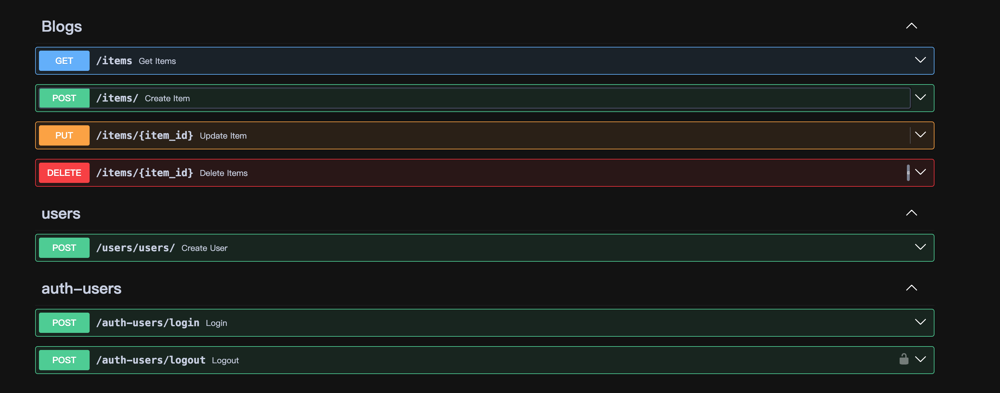

# python_bootcamp

Require Python 3.10+

## Environment build

```bash
python3.10 -m venv ./venv
source ./venv/bin/activate
pip install -r requirements.txt
```

## Service start up

```bash
uvicorn main:app --port 5000 --reload
```

## Docs

FastAPI has utilities to handle OpenAPI automatic UI documentation, including Swagger UI (by default at `/docs`)

http://localhost:5000/docs



## Transaction Handling

In each function that modifies the database (e.g., create_user, create_user_item, update_item, delete_item), we use a try-except block to manage transactions.

Commit: If the operation is successful, the changes are committed to the database using db.commit().
Rollback: If an exception occurs during the transaction, the operation is rolled back using db.rollback() to ensure that the database remains in a consistent state.

## Cache Handling

Caching is used to reduce the load on the database by storing frequently accessed data in memory. This improves the performance of the application by serving requests faster and reducing database queries.

In-Memory Caching with lru_cache
The functools.lru_cache decorator is used to cache the results of functions that fetch data from the database. This is particularly useful for data that does not change frequently, such as user details.
